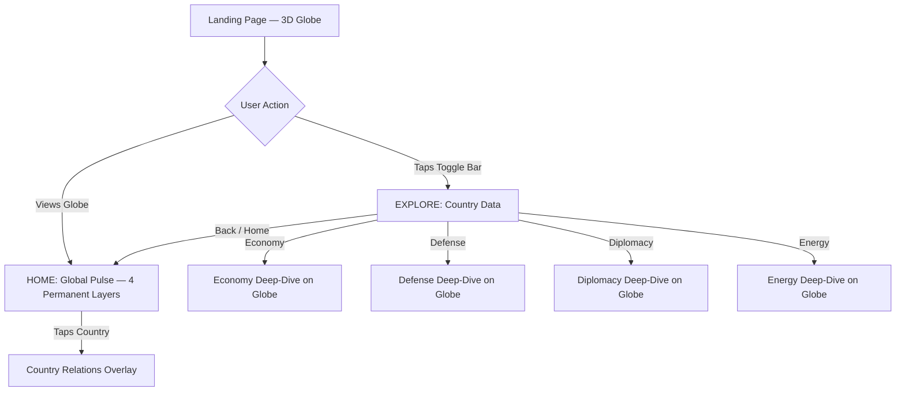
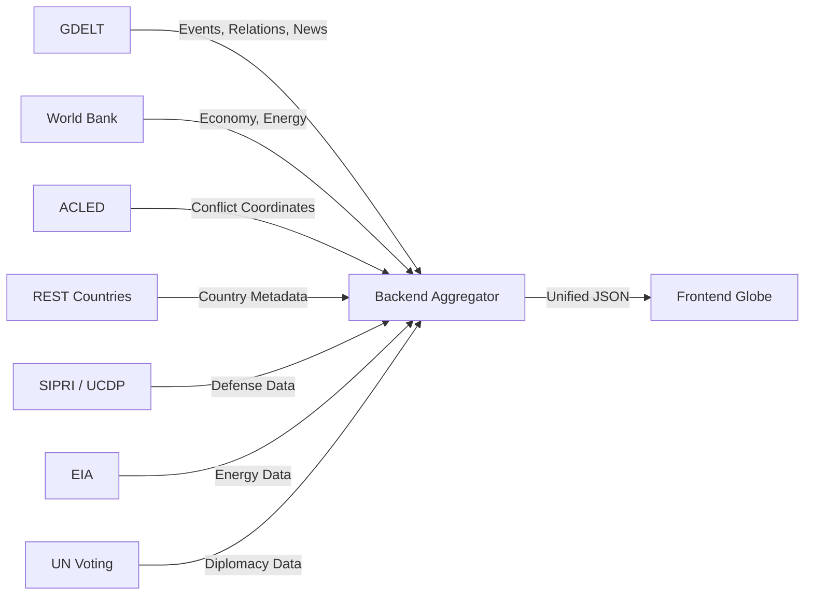
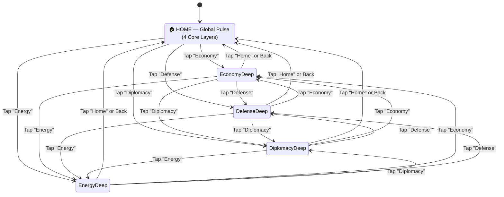

# 🌍 Geo-Politics 1.0 — Final Project Blueprint (v2 — LOCKED)

> **A real-time, interactive 3D globe that makes world geopolitics instantly understandable at a glance.**
>
> **Design Philosophy: "Don't show everything you can collect. Show only what helps someone understand geopolitics."**

---

## 📐 High-Level Architecture

```
                         🌍 GEO-POLITICS
                              │
                ┌─────────────┴─────────────┐
                │                           │
             HOME                       EXPLORE
          GLOBAL PULSE                 COUNTRY DATA
                │                           │
       ┌────────┼────────┐        ┌────┬────┼────┬─────┐
       │        │        │        │    │         │     │
      ⚔️       🏛️       💰       💰   🛡️       🤝    ⚡
     Wars    Summits  Economy  Econ  Defense  Diplo  Energy
       │                      (deep) (deep)  (deep) (deep)
       🤝
    Relations
```



### Core Principle
- **HOME / Global Pulse (Default)** → PART 1 is always visible — the 4 core permanent layers live on the globe
- **EXPLORE / Toggle Selection** → Globe **clears ALL Part 1 info**, shows **only** the selected category's data
- **Back to Home** → Part 1 returns with all permanent layers restored

### What Each Mode Answers

| Mode | Core Question |
|---|---|
| **🏠 Home (Global Pulse)** | *"What is happening in the world right now?"* |
| **💰 Economy** | *"How is this country economically connected?"* |
| **🛡️ Defense** | *"What is this country's security/military profile?"* |
| **🤝 Diplomacy** | *"Who does this country cooperate/engage with?"* |
| **⚡ Energy** | *"What resources/dependencies shape this country?"* |

---

## 🔴 PART 1 — HOME: Global Pulse (4 Permanent Layers)

> These 4 layers are **permanently visible** on the globe when the user first lands. They give a **complete world-situation snapshot** in under 10 seconds.

> [!IMPORTANT]
> **Maximum 4 core layers. FROZEN. Do NOT add more.** These are the only things that live on the landing globe.

---

### 1. ⚔️ Active Wars & Conflicts

**What it shows:** Every active armed conflict in the world — right now.

**Visual Treatment:**
| Element | Visual |
|---|---|
| **Active war zone** | Pulsing red glow circle on the conflict region |
| **Missile / Airstrike activity** | Animated arc trajectories (like missiles flying between attacker → target) with a faint trail + impact flash |
| **Ground conflict** | Shaking/vibrating border lines in the conflict zone |
| **Conflict intensity** | Size of the pulsing glow = intensity (small skirmish → full-scale war) |
| **Hover/Tap tooltip** | Shows: Conflict name, parties involved, start date, casualties estimate, status |

**Data Points:**
- Conflict name & type (interstate war, civil war, insurgency, territorial dispute)
- Countries/factions involved
- Start date & duration
- Estimated casualties (if available)
- Current status (active fighting, ceasefire, escalating)

**Animation Detail:**
- Missile arcs use a parabolic Bézier curve from origin → target
- Trail fades with a glowing orange-red gradient
- Impact point shows a brief radial shockwave ripple
- Multiple simultaneous arcs for heavy conflict zones

---

### 2. 🏛️ Summits & International Organizations

**What it shows:** Major geopolitical alliances, organizations, and active summits/meetings.

**Visual Treatment:**
| Element | Visual |
|---|---|
| **NATO** | NATO compass-star icon placed over member countries, connected by faint blue boundary lines |
| **UN** | UN emblem at HQ (NYC) + active peacekeeping mission locations as small blue helmet icons |
| **BRICS** | BRICS logo icon over member nations, connected by golden arcs |
| **EU** | EU star-circle icon, member nations highlighted with a subtle blue tint |
| **G7 / G20** | Respective logos floating over member capitals during summit periods |
| **QUAD** | Quad diamond icon connecting India, USA, Japan, Australia |
| **ASEAN** | ASEAN emblem over Southeast Asian member states |
| **Active Summit** | If a summit is happening NOW → animated glowing beacon at summit location + banner tooltip with summit name, date, agenda |

**Data Points:**
- Organization name, member countries, purpose
- Upcoming/ongoing summits (location, date, key agenda)
- Recent resolutions or joint statements

**Animation Detail:**
- Organization boundary lines subtly pulse (breathing effect)
- Active summits get a rotating radar-scan effect at the location
- Member country borders softly glow in the org's signature color

---

### 3. 💰 Economy Overview (Global Snapshot)

**What it shows:** A quick economic health indicator for every country — NOT rankings, just objective status.

**Visual Treatment:**
| Element | Visual |
|---|---|
| **GDP Scale** | Country surface brightness proportional to GDP size (brighter = larger economy) — no green/red "good/bad" judgment |
| **Stock Market Trend** | Tiny animated arrow (▲ / ▼) floating above major financial capitals (NYC, London, Tokyo, Mumbai, Shanghai, Frankfurt) |
| **Trade Routes** | Major global shipping/trade routes shown as faint animated dotted lines across oceans |
| **Economic Crisis** | ⚠️ warning triangle icon over countries in active economic crisis/recession |

**Data Points (Objective Only):**
- GDP (nominal)
- GDP growth rate (%)
- Major stock index direction (up/down/flat)
- Inflation snapshot (current rate)
- Active economic crises

**Animation Detail:**
- GDP brightness smoothly transitions as data updates
- Stock arrows gently bob up/down
- Trade route dots flow along shipping lanes like moving particles
- Crisis warning icons pulse with urgency

> [!NOTE]
> No heat-map "green = good, red = bad" — that's editorial judgment. We show **objective data** and let the viewer interpret.

---

### 4. 🤝 Country Relations

**What it shows:** Diplomatic relationship map — how any country relates to every other country.

**Visual Treatment:**

**Default State (No country selected):**
| Element | Visual |
|---|---|
| **Hostile borders** | Shared borders between hostile nations highlighted with a thick **red glowing line** (e.g., India-Pakistan, North Korea-South Korea, Israel-Palestine) |
| **Disputed territories** | Hatched/striped overlay pattern on disputed regions (e.g., Kashmir, Crimea, Taiwan Strait) |
| **Military standoffs** | Crossed-swords ⚔️ icon at border flashpoints |

**On Country Tap (e.g., user taps India):**
| Color | Meaning | Example |
|---|---|---|
| 🟢 **Green** | Strong ally / strategic partner | India → Russia, India → France |
| 🔴 **Red** | Hostile / adversarial / conflict | India → Pakistan, India → China (contested) |
| 🔵 **Blue** | Neutral / no significant relationship | India → most African nations, India → Peru |
| 🟡 **Yellow** | Complex / mixed relations (ally in some areas, rival in others) | India → China (trade partner + border rival) |
| ⚪ **Gray** | No diplomatic relations / unrecognized | India → nations with no formal ties |

**Data Points:**
- Bilateral relationship status
- Active disputes or treaties
- Trade relationship strength
- Military alliances
- Recent diplomatic events

**Animation Detail:**
- On country tap, the globe smoothly rotates to center that country
- Colored connection arcs radiate outward from the selected country to all others
- Arc thickness = strength of relationship (thick = deep ties, thin = minimal)
- Hostile borders crackle with a subtle electric/static effect
- Disputed territories shimmer with an unstable, shifting pattern

---

## 🔀 PART 2 — EXPLORE: Country Data (Toggle Bar)

> A sleek toggle bar sits at the top of the screen. Selecting a category **clears all Part 1 layers** from the globe and loads **only** that category's data.

```
┌────────────────────────────────────────────────────────────┐
│  🏠 Home  │  💰 Economy  │  🛡️ Defense  │  🤝 Diplomacy  │  ⚡ Energy  │
└────────────────────────────────────────────────────────────┘
```

### Toggle Behavior:
1. **Home (default)** → Part 1 — all 4 core layers visible (Global Pulse)
2. **Any category tap** → Globe wipes clean with a smooth fade transition → loads selected category's layer
3. **Tap same category again or tap Home** → returns to Part 1
4. **Tap different category** → Fade out current → Fade in new (no return to Part 1 in between)

### MVP Build Order:

| Priority | Category | Phase |
|---|---|---|
| 🥇 MVP Phase 1 | 💰 Economy + 🛡️ Defense | Build first |
| 🥈 Expansion Phase 2 | 🤝 Diplomacy + ⚡ Energy | Add after MVP is stable |

---

### Category 1: 💰 Economy (Deep Dive) — MVP

> When user taps **Economy** toggle — globe transforms into a full economic data visualization.

**On Globe Surface (Country Level):**

| Data Point | Visual on Globe | Interaction |
|---|---|---|
| **GDP** | Country brightness = GDP size, number label showing value | Tap → full GDP breakdown |
| **GDP Growth** | Animated ring around country: expanding (growing) / contracting (shrinking), color intensity = rate | Tap → growth trend chart |
| **Inflation Rate** | Thermometer icon (🌡️) — taller = higher inflation | Tap → historical inflation |
| **Unemployment Rate** | Person icon (👤) with % badge | Tap → employment details |
| **Trade Balance** | Scale icon (⚖️) — tilted left (deficit) or right (surplus) | Tap → top import/export partners |
| **Debt-to-GDP** | Chain link icon (🔗) — more links = higher ratio | Tap → debt breakdown |

**On Country Tap (Detailed Economy Panel):**

A sleek side-panel slides in showing:

```
┌─────────────────────────────────┐
│  🇮🇳 INDIA — Economy             │
├─────────────────────────────────┤
│                                 │
│  GDP:           $3.7 Trillion   │
│  GDP Growth:    +6.8%           │
│  Inflation:     4.2%            │
│  Unemployment:  7.1%            │
│  Debt-to-GDP:   83%             │
│  Currency:      ₹ (INR)        │
│                                 │
├─────────────────────────────────┤
│  🔝 Top Trade Partners:         │
│                                 │
│  1. 🇺🇸 USA     — $128B         │
│  2. 🇨🇳 China   — $115B         │
│  3. 🇦🇪 UAE     — $88B          │
│                                 │
│  (Animated arcs on globe show   │
│   trade flow direction + volume)│
│                                 │
├─────────────────────────────────┤
│  💵 External Debt:               │
│                                 │
│  World Bank:  $21B              │
│  IMF:         $0                │
│  Bilateral:   $5B               │
│                                 │
└─────────────────────────────────┘
```

**Globe Animations for Economy Mode:**
- Trade arcs animate between countries showing flow direction (export → import)
- Arc thickness = trade volume
- Particle dots flow along arcs showing trade movement
- Countries with economic crisis flash with a warning pulse
- GDP growth rings expand/contract rhythmically

**Key Data Points (6 core — no more):**
1. GDP (nominal)
2. GDP Growth Rate
3. Inflation Rate
4. Unemployment Rate
5. Trade Balance / Top Partners
6. Debt-to-GDP Ratio

---

### Category 2: 🛡️ Defense (Deep Dive) — MVP

> Globe transforms into a military/defense data visualization.

> [!WARNING]
> **No subjective ratings (8.2/10, 9.5/10).** This is NOT a "who is stronger" leaderboard. Show **objective, verifiable data** and let the user draw conclusions.

**On Globe Surface (Country Level):**

| Data Point | Visual on Globe | Interaction |
|---|---|---|
| **Nuclear Status** | ☢️ Radiation symbol over nuclear-armed nations — uniform size, just marks who has nukes | Tap → warhead count, delivery systems, treaty status |
| **Military Expenditure** | Country brightness proportional to defense budget (brighter = higher spending) | Tap → budget breakdown |
| **Active Personnel** | Soldier silhouette icon with number label | Tap → personnel details |
| **Arms Transfers** | Animated arcs showing who sells weapons to whom (seller → buyer) | Tap → transfer details |
| **Military/Security Partnerships** | Colored connection lines between partnered nations | Tap → partnership details |

**On Country Tap (Detailed Defense Panel):**

```
┌──────────────────────────────────┐
│  🇮🇳 INDIA — Defense              │
├──────────────────────────────────┤
│                                  │
│  Defense Budget:    $74 Billion   │
│  % of GDP:         2.4%          │
│  Active Personnel:  1.45 Million │
│  Reserve:           1.15 Million │
│                                  │
├──────────────────────────────────┤
│  ☢️ Nuclear Status:               │
│                                  │
│  Status:     Nuclear Armed       │
│  Est. Warheads:  ~170            │
│  Delivery:   Land + Sea + Air    │
│  (Triad Capable)                 │
│  NPT Status: Non-signatory       │
│                                  │
├──────────────────────────────────┤
│  🔫 Arms Transfers:               │
│                                  │
│  Top Suppliers:                  │
│  1. 🇷🇺 Russia    — 45%          │
│  2. 🇫🇷 France    — 29%          │
│  3. 🇮🇱 Israel    — 11%          │
│                                  │
│  (Arcs on globe show flow)       │
│                                  │
├──────────────────────────────────┤
│  🤝 Security Partnerships:        │
│                                  │
│  QUAD, SCO (Member)              │
│  Bilateral: Russia, France, USA  │
│                                  │
└──────────────────────────────────┘
```

**Globe Animations for Defense Mode:**
- Nuclear nations have a subtle pulsing radiation ring (uniform — NOT sized by warhead count)
- Arms transfer arcs animate from seller → buyer with flowing particles
- Arc thickness = transfer volume (TIV — SIPRI Trend Indicator Values)
- Security partnership lines pulse in a shared color
- Active deployment zones have marching-dot animations

**Key Data Points (5 core — no more):**
1. Military Expenditure ($ + % of GDP)
2. Active/Reserve Personnel
3. Nuclear Status (yes/no + warhead estimate + delivery capability)
4. Arms Transfers (who buys from whom, top suppliers/buyers)
5. Military/Security Partnerships & Alliances

---

### Category 3: 🤝 Diplomacy (Deep Dive) — Expansion

> Globe transforms into a diplomatic engagement and international cooperation visualization.

**Why this is core:** Diplomacy is *active* geopolitics — treaties, embassies, UN voting patterns, sanctions. This tells you how countries actually *interact* with the world.

**On Globe Surface (Country Level):**

| Data Point | Visual on Globe | Interaction |
|---|---|---|
| **Embassy/Consulate Network** | Dot icons at capital cities where country has embassies — more dots = wider diplomatic reach | Tap → full embassy list |
| **Active Treaties** | Handshake icon (🤝) with count badge between countries with active bilateral treaties | Tap → treaty details |
| **UN Voting Alignment** | Country color: similar color = votes similarly in UNGA (cluster analysis) | Tap → voting record |
| **Sanctions (Active)** | 🚫 Ban icon over sanctioned nations — with directional arc showing who sanctioned whom | Tap → sanction details |
| **Diplomatic Incidents** | ⚡ Lightning bolt at locations of recent diplomatic crises (embassy closures, expulsions, recalls) | Tap → incident details |

**On Country Tap (Detailed Diplomacy Panel):**

```
┌───────────────────────────────────┐
│  🇮🇳 INDIA — Diplomacy             │
├───────────────────────────────────┤
│                                   │
│  Embassies Abroad:    178         │
│  Foreign Embassies:   162         │
│  Active Treaties:     ~400        │
│                                   │
├───────────────────────────────────┤
│  🗳️ UN Voting Patterns:           │
│                                   │
│  Votes WITH:                      │
│  🇷🇺 Russia    — 72% alignment    │
│  🇨🇳 China     — 68% alignment    │
│                                   │
│  Votes AGAINST:                   │
│  🇺🇸 USA       — 41% alignment    │
│  🇬🇧 UK        — 45% alignment    │
│                                   │
│  (Colored arcs on globe)          │
│                                   │
├───────────────────────────────────┤
│  🚫 Sanctions:                     │
│                                   │
│  Imposed by India: 0              │
│  Imposed on India: 0              │
│                                   │
├───────────────────────────────────┤
│  📋 Recent Diplomatic Activity:    │
│                                   │
│  • PM Modi visits France (Oct 1)  │
│  • India-Australia 2+2 (Sep 28)   │
│  • UNGA speech (Sep 24)           │
│                                   │
└───────────────────────────────────┘
```

**Globe Animations for Diplomacy Mode:**
- Embassy dots glow softly at capital cities
- UN voting alignment shown as colored clusters — countries with similar voting patterns share colors
- Sanction arcs pulse with a red restrictive tone
- Recent diplomatic events shown as animated news-flash beacons
- Treaty connection lines between countries with active bilateral agreements

**Key Data Points (5 core — no more):**
1. Embassy/Consulate Network (diplomatic reach)
2. Active Bilateral Treaties
3. UN Voting Alignment (who votes with whom)
4. Active Sanctions (imposed/received)
5. Recent Diplomatic Events & Activity

---

### Category 4: ⚡ Energy (Deep Dive) — Expansion

> Globe transforms into energy resource, dependency, and infrastructure visualization.

**Why this is core:** Energy dependencies literally *cause* wars and *shape* alliances. Russia-Europe gas, Middle East oil, China's rare earth monopoly, Strait of Hormuz — energy IS geopolitics.

**On Globe Surface (Country Level):**

| Data Point | Visual on Globe | Interaction |
|---|---|---|
| **Oil/Gas Production** | Oil derrick icon (🛢️) — size proportional to production volume | Tap → production/reserve data |
| **Energy Imports/Exports** | Animated pipeline/shipping arcs between countries — showing energy flow direction | Tap → energy trade partners |
| **Renewable Energy %** | Wind turbine icon (🌬️) — green glow intensity = higher renewable share | Tap → renewable breakdown |
| **Strategic Chokepoints** | ⚠️ Danger markers at key energy chokepoints (Strait of Hormuz, Suez Canal, Strait of Malacca, Bosporus) | Tap → chokepoint details |
| **Critical Minerals** | ⛏️ Mining icon over countries with significant rare earth/critical mineral reserves | Tap → mineral details |

**On Country Tap (Detailed Energy Panel):**

```
┌───────────────────────────────────┐
│  🇮🇳 INDIA — Energy                │
├───────────────────────────────────┤
│                                   │
│  Energy Profile:                  │
│  Oil Production:   0.77M bbl/day  │
│  Gas Production:   33.7 Bcm/yr    │
│  Oil Reserves:     4.7B barrels   │
│  Energy Import Dependent: 80%     │
│                                   │
├───────────────────────────────────┤
│  🛢️ Energy Imports From:           │
│                                   │
│  1. 🇮🇶 Iraq       — 27%          │
│  2. 🇸🇦 Saudi      — 18%          │
│  3. 🇷🇺 Russia     — 15%          │
│  4. 🇦🇪 UAE        — 12%          │
│                                   │
│  (Animated pipeline arcs on globe)│
│                                   │
├───────────────────────────────────┤
│  🌬️ Renewable Mix:                 │
│                                   │
│  Solar:    16%                    │
│  Wind:     10%                    │
│  Hydro:    12%                    │
│  Nuclear:   3%                    │
│  Fossil:   59%                    │
│                                   │
├───────────────────────────────────┤
│  ⛏️ Critical Minerals:              │
│                                   │
│  Thorium: #1 globally (largest)   │
│  Iron Ore: #4 globally            │
│  Rare Earths: Limited             │
│  Depends on 🇨🇳 China for 60%+    │
│                                   │
└───────────────────────────────────┘
```

**Globe Animations for Energy Mode:**
- Oil/gas pipeline arcs animate as flowing liquid particles (dark for oil, light blue for gas)
- Arc thickness = volume of energy trade
- Strategic chokepoints pulse with warning amber glow
- Renewable energy icons rotate gently (wind turbines spin, solar panels shimmer)
- Critical mineral deposits shown as glowing deposits embedded in country surface
- Energy-dependent countries connected to their suppliers with dependency arcs (thicker = more dependent)

**Key Data Points (5 core — no more):**
1. Oil/Gas Production & Reserves
2. Energy Imports/Exports (who depends on whom)
3. Renewable Energy Mix (% breakdown)
4. Strategic Chokepoints & Pipeline Routes
5. Critical Minerals & Rare Earth Dependencies

---

## 📰 News Architecture — GDELT-First Pipeline

> [!IMPORTANT]
> **MVP uses GDELT as the single primary news/event engine.** No need for 4 different news APIs.

```
                     NEWS PIPELINE
                         │
                    ┌────┴────┐
                    │  GDELT  │
                    └────┬────┘
                         │
                         ▼
                Event Extraction
              (conflict, diplomacy,
               economy, protest)
                         │
                         ▼
            Country + Category + Date
                         │
                         ▼
              Geocoded + Classified
                         │
                         ▼
              Backend Aggregator
              (cache + normalize)
                         │
                         ▼
                    🌍 Globe
```

### Why GDELT Alone Is Enough for MVP

| Capability | GDELT |
|---|---|
| Coverage | Every country, 65 languages |
| Update speed | Every 15 minutes |
| Event classification | Conflict, diplomacy, economy, protest, natural disaster |
| Geocoding | Lat/long for every event |
| Relationship tone | Positive/negative tone between any two countries |
| Cost | 100% free, no API key |
| Historical depth | 1979–present |

### Future Expansion (Post-MVP)
- **NewsData.io** (200 req/day free) — for human-readable article headlines in the news ticker
- **ACLED** — for higher-precision conflict event coordinates

---

## 🔌 Data Sources — Free APIs (Complete)

> All data must come from **free, regularly-updated** sources.

### 🔥 Primary APIs (MVP — Use These First)

| API | Powers Which Feature | Free Tier | Update Frequency |
|---|---|---|---|
| **[GDELT Project](https://www.gdeltproject.org/)** | Wars, Relations, Events, News — the backbone | ✅ 100% Free, No Key | Every 15 min |
| **[World Bank API](https://datahelpdesk.worldbank.org/knowledgebase/topics/125589)** | GDP, inflation, unemployment, trade, debt, population — 16,000+ indicators | ✅ 100% Free, No Key | Quarterly / Annual |
| **[REST Countries](https://restcountries.com/)** | Country metadata: borders, flags, currencies, region, languages | ✅ 100% Free, No Key | Static |
| **[ACLED](https://acleddata.com/)** | Precise conflict event coordinates, battle data, protest locations | ✅ Free (register) | Weekly |
| **[SIPRI Databases](https://www.sipri.org/databases)** | Military expenditure, arms transfers, nuclear arsenals | ✅ Free datasets | Annual |

### 💰 Economy APIs

| API | What It Provides | Free Tier | Update Frequency |
|---|---|---|---|
| **[World Bank API](https://datahelpdesk.worldbank.org/knowledgebase/topics/125589)** | GDP, inflation, unemployment, trade, debt | ✅ Free | Quarterly / Annual |
| **[IMF Data API](https://datahelp.imf.org/knowledgebase/articles/667681)** | Exchange rates, economic outlook, debt statistics | ✅ Free | Monthly / Quarterly |
| **[Open Exchange Rates](https://openexchangerates.org/)** | Real-time currency exchange rates | ✅ Free: 1000 req/month | Hourly |

### 🛡️ Defense APIs

| API | What It Provides | Free Tier | Update Frequency |
|---|---|---|---|
| **[SIPRI](https://www.sipri.org/databases)** | Military expenditure, arms transfers (TIV), nuclear arsenals | ✅ Free datasets | Annual |
| **[ACLED](https://acleddata.com/)** | Conflict events with coordinates, fatalities | ✅ Free (register) | Weekly |
| **[UCDP](https://ucdp.uu.se/)** | Armed conflict dataset, battle deaths, one-sided violence | ✅ Free API | Annual |

### 🤝 Diplomacy APIs

| API | What It Provides | Free Tier | Update Frequency |
|---|---|---|---|
| **[GDELT GKG](https://blog.gdeltproject.org/gdelt-2-0-our-global-world-in-realtime/)** | Relationship tone between countries, diplomatic events, cooperation/hostility scores | ✅ Free | Every 15 min |
| **[UN Voting Data](https://dataverse.harvard.edu/dataset.xhtml?persistentId=hdl:1902.1/12379)** | UNGA voting records — reveals true alignment patterns | ✅ Free | Per session |
| **[Correlates of War](https://correlatesofwar.org/)** | Alliance data, diplomatic exchanges, territorial claims | ✅ Free datasets | Annual |
| **[REST Countries](https://restcountries.com/)** | Borders, neighboring countries, regional groupings | ✅ Free | Static |

### ⚡ Energy APIs

| API | What It Provides | Free Tier | Update Frequency |
|---|---|---|---|
| **[EIA (US Energy Information Admin)](https://www.eia.gov/opendata/)** | Oil/gas production, reserves, energy trade, consumption — global coverage | ✅ Free (API key required) | Monthly / Annual |
| **[World Bank Energy Indicators](https://datahelpdesk.worldbank.org/)** | Renewable energy %, fossil fuel dependency, electricity access, CO₂ emissions | ✅ Free | Annual |
| **[IEA Free Data](https://www.iea.org/data-and-statistics)** | Energy balances, key energy statistics (partial free access) | ✅ Partial free | Annual |
| **[IRENA (Renewable Energy)](https://www.irena.org/Statistics)** | Renewable energy capacity by country | ✅ Free datasets | Annual |

---

## 🧠 API Strategy — The Smart Approach



> [!TIP]
> **Backend aggregator layer** fetches from all APIs, normalizes into a unified JSON schema per country, caches it, and serves it to the frontend. The globe only talks to ONE endpoint.

### Caching & Update Strategy

| Data Type | Cache Duration | Update Source |
|---|---|---|
| Conflicts & Wars | 1 hour | GDELT + ACLED |
| Relations / Tone | 6 hours | GDELT tone analysis |
| Economy (GDP, etc.) | 24 hours | World Bank / IMF |
| Defense | 7 days | SIPRI + UCDP |
| Diplomacy | 12 hours | GDELT + UN Voting |
| Energy | 24 hours | EIA + World Bank |
| Country Metadata | 30 days | REST Countries |

---

## 🎨 UI/UX Design Specifications

### Globe Technology
- **Three.js** + **Globe.gl** (or **CesiumJS** for high-fidelity) for the 3D globe
- WebGL-powered for smooth 60fps animations
- Touch/mouse interaction: rotate, zoom, tap countries

### Color Palette (Dark Theme)

| Element | Color | Hex |
|---|---|---|
| Background | Deep Space Black | `#0a0e17` |
| Globe Ocean | Dark Navy | `#0d1b2a` |
| Globe Land (default) | Slate Gray | `#1b2838` |
| Globe Borders | Dim White | `#ffffff20` |
| Accent Primary | Electric Blue | `#00d4ff` |
| War/Conflict | Crimson Red | `#ff2d55` |
| Ally/Positive | Emerald Green | `#00e676` |
| Neutral | Steel Blue | `#5c7cfa` |
| Warning/Crisis | Amber | `#ffab00` |
| Energy | Electric Orange | `#ff6d00` |
| Diplomacy | Royal Purple | `#7c4dff` |
| Text Primary | White | `#f0f0f0` |
| Text Secondary | Gray | `#8892a0` |
| Panel Background | Glass Dark | `#0d1b2a` with `backdrop-filter: blur(20px)` |

### Typography
- **Headlines:** `Space Grotesk` or `Outfit` (geometric, modern)
- **Body/Data:** `Inter` or `JetBrains Mono` (for numbers/stats)
- **Icons:** Custom SVG icons + Phosphor Icons library

### Layout

```
┌─────────────────────────────────────────────────────────────────┐
│  LOGO    🏠 Home │ 💰 Economy │ 🛡️ Defense │ 🤝 Diplomacy │ ⚡ Energy │
├─────────────────────────────────────────────────────────────────┤
│                                                                 │
│                        🌍 3D GLOBE                              │
│                        (Full viewport)                          │
│                                                                 │
│                                                                 │
│  ┌──────────────┐                       ┌──────────────────┐    │
│  │ LEGEND       │                       │ COUNTRY PANEL    │    │
│  │ ⚔️ Wars      │                       │ (slides in on    │    │
│  │ 🏛️ Orgs      │                       │  country tap)    │    │
│  │ 💰 Economy   │                       │                  │    │
│  │ 🤝 Relations │                       │                  │    │
│  └──────────────┘                       └──────────────────┘    │
│                                                                 │
│  ┌──────────────────────────────────────────────────────────┐   │
│  │  📰 LIVE NEWS TICKER — scrolling latest GDELT headlines   │   │
│  └──────────────────────────────────────────────────────────┘   │
└─────────────────────────────────────────────────────────────────┘
```

### Animation Standards

| Animation | Duration | Easing |
|---|---|---|
| Globe rotation (to country) | 800ms | `cubic-bezier(0.25, 0.1, 0.25, 1)` |
| Layer fade transition | 400ms | `ease-in-out` |
| Missile arc travel | 2000ms | `linear` |
| Panel slide-in | 300ms | `ease-out` |
| Data pulse/glow | 1500ms | `ease-in-out` (loop) |
| Toggle switch | 200ms | `ease` |
| Tooltip appear | 150ms | `ease-out` |
| Pipeline flow (energy) | 3000ms | `linear` (loop) |
| Arms transfer arc | 2500ms | `linear` |

---

## 🗂️ Project File Structure

```
Geo-Politics-1.0/
├── index.html                    # Entry point
├── css/
│   ├── index.css                 # Design system & tokens
│   ├── globe.css                 # Globe-specific styles
│   ├── panels.css                # Side panels & tooltips
│   ├── toggle.css                # Toggle bar styles
│   └── animations.css            # All keyframe animations
├── js/
│   ├── app.js                    # Main app controller & state machine
│   ├── globe/
│   │   ├── globe-core.js         # 3D globe init (Three.js / Globe.gl)
│   │   ├── globe-layers.js       # Layer management (add/remove/toggle)
│   │   ├── globe-animations.js   # Missile arcs, pulses, glows, pipelines
│   │   └── globe-interactions.js # Click, hover, rotate handlers
│   ├── layers/
│   │   ├── wars-layer.js         # Part 1: War/conflict visualization
│   │   ├── orgs-layer.js         # Part 1: Organizations & summits
│   │   ├── economy-overview.js   # Part 1: Economy snapshot
│   │   ├── relations-layer.js    # Part 1: Country relations & borders
│   │   ├── economy-deep.js       # Part 2: Economy deep-dive (MVP)
│   │   ├── defense-deep.js       # Part 2: Defense deep-dive (MVP)
│   │   ├── diplomacy-deep.js     # Part 2: Diplomacy deep-dive (Expansion)
│   │   └── energy-deep.js        # Part 2: Energy deep-dive (Expansion)
│   ├── data/
│   │   ├── api-service.js        # API fetching & caching layer
│   │   ├── gdelt-client.js       # GDELT API integration
│   │   ├── worldbank-client.js   # World Bank API integration
│   │   ├── acled-client.js       # ACLED API integration
│   │   ├── sipri-client.js       # SIPRI data integration
│   │   ├── eia-client.js         # EIA energy data integration
│   │   └── country-data.js       # Static country metadata (REST Countries)
│   └── ui/
│       ├── toggle-bar.js         # Toggle bar component
│       ├── country-panel.js      # Country detail panel
│       ├── news-ticker.js        # Live GDELT news ticker
│       ├── legend.js             # Map legend component
│       └── tooltips.js           # Hover tooltips
├── assets/
│   ├── icons/                    # SVG icons for orgs, symbols
│   ├── textures/                 # Globe textures (earth, bump map)
│   └── fonts/                    # Custom fonts
├── data/
│   └── static/                   # Fallback static JSON data
│       ├── countries.json        # Country boundaries & metadata
│       ├── organizations.json    # Org membership data
│       ├── conflicts.json        # Known active conflicts
│       ├── relations.json        # Baseline relationship data
│       ├── energy.json           # Energy production/reserves baseline
│       └── defense.json          # Military data baseline
└── all_refrence-ui/
    └── refrence-website-links.txt
```

---

## 🔄 State Machine — Layer Switching Logic



**Transition Rules:**
1. Only **ONE mode** active at a time — no mixing Part 1 + Part 2
2. Switching between Part 2 categories: Fade out current → Fade in new (no return to Part 1 in between)
3. All transitions use the **400ms fade** standard
4. Globe rotation state is **preserved** across transitions (camera doesn't reset)
5. Any open country panel **closes** on mode switch
6. Legend panel **updates** to reflect the active mode's symbols

---

## 🚀 Development Phases

### Phase 1 — Foundation (Week 1-2)
- [ ] Set up project with Three.js / Globe.gl
- [ ] Render basic interactive 3D globe (rotate, zoom, tap)
- [ ] Load country boundaries (GeoJSON)
- [ ] Implement toggle bar UI (Home + Economy + Defense — Diplomacy & Energy disabled/greyed out)
- [ ] Set up API service layer with caching
- [ ] GDELT integration (event fetching + news pipeline)

### Phase 2 — Part 1 Core Layers (Week 3-4)
- [ ] Wars & Conflicts layer (ACLED + GDELT data)
- [ ] Missile arc animations
- [ ] Organizations & Summits layer (static data + GDELT summit events)
- [ ] Economy overview on globe (World Bank data)
- [ ] Relations layer with color-coded connections (GDELT tone)

### Phase 3 — Part 2 MVP Deep Dives (Week 5-6)
- [ ] 💰 Economy deep-dive (GDP, inflation, unemployment, trade arcs, debt)
- [ ] 🛡️ Defense deep-dive (expenditure, nuclear status, personnel, arms transfers, partnerships)
- [ ] Country detail panels for both modes
- [ ] Mode switching logic (state machine)

### Phase 4 — Polish MVP (Week 7-8)
- [ ] Live GDELT news ticker
- [ ] Smooth layer transitions & animations
- [ ] Mobile responsiveness
- [ ] Performance optimization (LOD, data throttling)
- [ ] Final visual polish (glassmorphism, micro-animations)
- [ ] Fallback static data for API failures

### Phase 5 — Expansion (Week 9-10)
- [ ] 🤝 Diplomacy deep-dive (embassies, UN voting, treaties, sanctions)
- [ ] ⚡ Energy deep-dive (oil/gas, pipelines, renewables, minerals, chokepoints)
- [ ] Enable Diplomacy & Energy toggle buttons
- [ ] Additional API integrations (EIA, UN Voting, Correlates of War)

---

## ⚠️ Key Design Rules

> [!CAUTION]
> These rules are **non-negotiable** to keep the project clean and usable.

1. **Maximum 4 core layers on Part 1** — FROZEN. Never add more.
2. **Maximum 4 toggle categories in Part 2** — Economy, Defense, Diplomacy, Energy. That's it.
3. **No subjective ratings** — No "Defense 8.2/10". Show objective data. Let users think.
4. **No data overload per country tap** — Maximum 5-6 core data points per panel.
5. **Every data point needs a visual** — No raw numbers without an icon, color, or animation.
6. **Dark theme only** — Light backgrounds kill the premium feel of a globe visualization.
7. **Animations serve purpose** — Every animation must communicate information, not just look cool.
8. **Mobile-first interactions** — Tap-friendly, no hover-dependent features.
9. **Graceful data fallbacks** — If an API fails, show cached/static data with a "last updated" timestamp.
10. **Clean globe = effective globe** — When in doubt, remove visual elements, don't add.
11. **GDELT-first** — Don't add more news APIs until GDELT isn't enough.
12. **MVP-first** — Economy + Defense first. Ship. Then Diplomacy + Energy.

---

> **This project turns the complexity of world geopolitics into a single, beautiful, interactive experience. One globe. Everything you need to understand what's happening in the world.**
>
> *"Don't show everything you can collect. Show only what helps someone understand geopolitics."*
